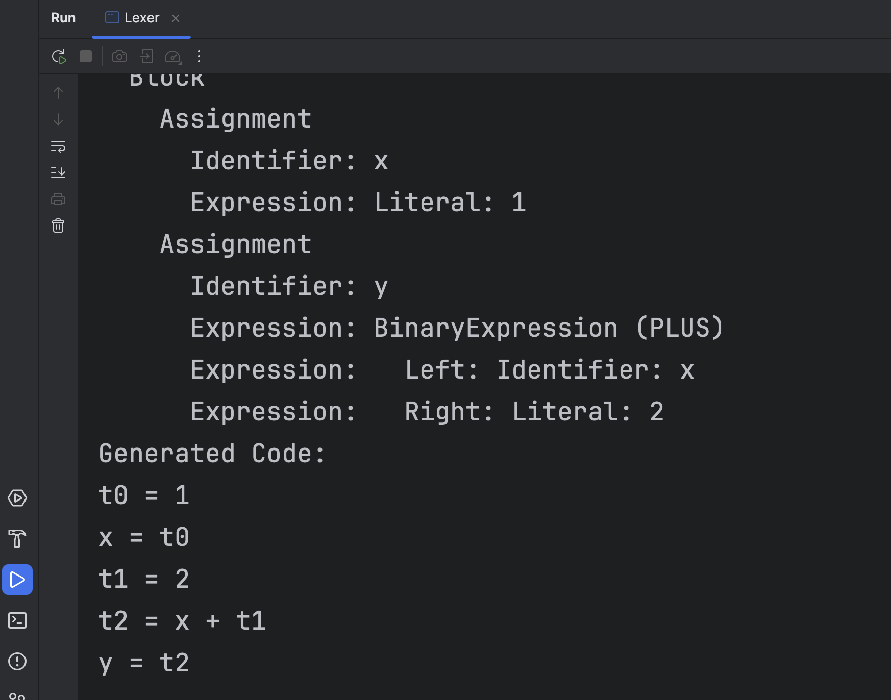

### Team Members
- **Chunyu Sui**, cs4480
- **Huiyuan Li**, hl3700
  

### Sample out put
This is the screenshot of running the lexer program, you can refer to it to have a 
scratch understanding of its workflow.



If you want to run it, this is the script you need to use:


### Project Title
**Custom Lexer for Programming Language**

### Overview
This project implements a lexer in Java that processes input source code written in a custom programming language and outputs a list of tokens. The lexer is powered by Spring Boot, and can be easily started using Maven commands or the provided script.

### Features
- **Tokenization of source code**: The lexer breaks down input source code into token types such as keywords, identifiers, literals, operators, and delimiters.
- **State transitions**: Implements finite automata for lexical analysis.
- **Error handling**: Detects and reports lexical errors, such as unrecognized tokens.

### Prerequisites

#### Installation Steps for Java and Maven
Ensure that you have the following installed on your system:
1. **Java Development Kit (JDK)**: Version 17 or above.
2. **Maven**: Ensure that Maven is installed and configured.

You can check if Java and Maven are installed by running:

```bash
java -version
mvn -version
```

If not installed, follow these steps:

- **Install Java**:
   - On **Linux (Ubuntu/Debian)**:
     ```bash
     sudo apt update
     sudo apt install openjdk-17-jdk
     ```

   - On **macOS**:
     ```bash
     brew install openjdk@17
     ```

   - On **Windows**:
      - Download and install the JDK from the [Oracle website](https://www.oracle.com/java/technologies/javase-jdk11-downloads.html).

- **Install Maven**:
   - On **Linux**:
     ```bash
     sudo apt install maven
     ```
   - On **macOS**:
     ```bash
     brew install maven
     ```
   - On **Windows**:
      - Download from [Maven](https://maven.apache.org/download.cgi) and follow the installation instructions.

### Running the Lexer Using Spring Boot

1. **Ensure Dependencies are Installed**:
   First, make sure all the necessary dependencies are installed by running the Maven `clean install` command.

    ```bash
    mvn clean install
    ```

   This will download all dependencies and compile the project.

2. **Run the Lexer**:
   You can run the lexer directly using the provided shell script 
(I understand that setting `a=rwx` isn't the safest option, but it simplifies the process by granting full permissions).
    ```bash
   chmod a= rwx run_lexer.sh
    ./run_lexer.sh
    ```

   The script contains the following command:

    ```bash
    mvn spring-boot:run
    ```

   This command will start the Spring Boot application, and the lexer will be executed upon startup.

3. **Modify the Input Program**:
   The lexer operates on hardcoded input inside the `LexerApplication.java` file. You can modify this file to include the source code you want the lexer to analyze.

4. **Example Output**:
   For an input program like:

    ```c
    if (x == 10) return x;
    ```

   The output will be:
    ```
    <KEYWORD, if>
    <DELIMITER, (>
    <IDENTIFIER, x>
    <OPERATOR, ==>
    <LITERAL, 10>
    <DELIMITER, )>
    <KEYWORD, return>
    <IDENTIFIER, x>
    <DELIMITER, ;>
    ```

### Error Handling
If the input code contains an unrecognized token or other lexical errors, the lexer will print an error message, indicating the issue and its position in the code.

For example, for input:
```c
x @ 10;
```

The output will include:
```
<IDENTIFIER, x>
<ERROR, Unrecognized token '@' at index 2>
<LITERAL, 10>
<DELIMITER, ;>
```

